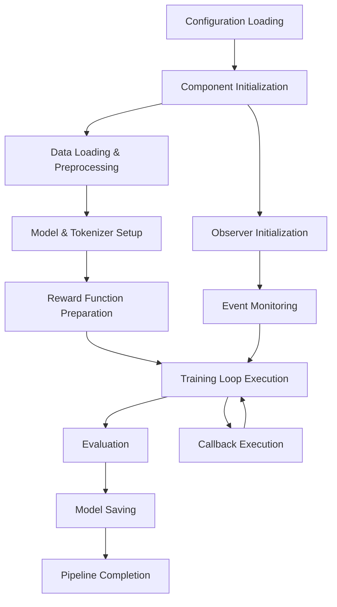

# 🏗️ RLVR Training Pipeline Architecture

## Overview

This project implements a **composable component orchestrator** for **Reinforcement Learning from Verifiable Rewards (RLVR)** training pipelines for Large Language Models. The system is specifically designed for reasoning tasks where rewards can be computed from verifiable outcomes (e.g., mathematical correctness, logical validity).

The architecture enables researchers to train reasoning models by simply modifying Hydra configuration files without touching the core codebase.

## 🎯 Design Philosophy

### Core Principles

1. **Verifiable Rewards**: Focus on tasks with objectively verifiable outcomes
2. **Composability**: Independent, swappable components
3. **Configuration-Driven**: All behavior controlled through YAML configurations
4. **Reasoning-Focused**: Optimized for structured reasoning tasks
5. **Reproducibility**: Deterministic execution with comprehensive logging

### Key Benefits

- **Zero Code Changes**: Experiment through configuration only
- **RLVR Specialization**: Built-in support for verifiable reward functions
- **Reasoning Optimization**: Structured prompting and format checking
- **Research Velocity**: Rapid iteration on reasoning strategies

## 🏛️ System Architecture

```
┌─────────────────────────────────────────────────────────────────┐
│                    Pipeline Orchestrator                        │
│  ┌─────────────────────────────────────────────────────────┐   │
│  │                Configuration Layer                       │   │
│  │              (Hydra + YAML Configs)                     │   │
│  └─────────────────────────────────────────────────────────┘   │
│                              │                                  │
│  ┌─────────────────────────────────────────────────────────┐   │
│  │                Component Registry                        │   │
│  │  ┌─────────┐ ┌─────────┐ ┌─────────┐ ┌─────────────┐   │   │
│  │  │  Data   │ │  Model  │ │ Reward  │ │ Training    │   │   │
│  │  │Component│ │Component│ │Component│ │ Loop        │   │   │
│  │  └─────────┘ └─────────┘ └─────────┘ └─────────────┘   │   │
│  │  ┌─────────┐ ┌─────────┐                               │   │
│  │  │Evaluation│ │Observer │                               │   │
│  │  │Component│ │Component│                               │   │
│  │  └─────────┘ └─────────┘                               │   │
│  └─────────────────────────────────────────────────────────┘   │
│                              │                                  │
│  ┌─────────────────────────────────────────────────────────┐   │
│  │                Execution Engine                          │   │
│  │        (Component Lifecycle Management)                 │   │
│  └─────────────────────────────────────────────────────────┘   │
└─────────────────────────────────────────────────────────────────┘
```

## 📁 Project Structure

```
├── conf/                           # Hydra configuration files
│   ├── config.yaml                 # Main pipeline configuration
│   ├── data_component/             # Data loading configurations
│   ├── model_component/            # Model and adapter configurations
│   ├── training_loop_component/    # Training algorithm configurations
│   ├── reward_component/           # Reward function configurations
│   ├── evaluation_component/       # Evaluation strategy configurations
│   ├── prompts/                    # Prompt templates and strategies
│   └── common/                     # Shared configuration utilities
├── src/
│   ├── orchestration/              # Pipeline orchestration logic
│   │   └── pipeline_orchestrator.py
│   ├── components/                 # Modular components
│   │   ├── base_component.py       # Abstract base component
│   │   ├── data/                   # Data loading and processing
│   │   ├── model/                  # Model management and adapters
│   │   ├── training_loop/          # Training algorithms (GRPO, PPO, etc.)
│   │   ├── reward/                 # Reward function implementations
│   │   ├── evaluation/             # Evaluation strategies
│   │   └── observers/              # Monitoring and logging
│   └── utils/                      # Shared utilities
├── infrastructure/                 # Cloud deployment configurations
├── tests/                          # Component and integration tests
└── run_pipeline.py                 # Main entry point
```

## 🔧 Component Architecture

### Component Interface Pattern

All components follow a standardized interface pattern:

```python
class ComponentInterface(BaseComponent):
    def __init__(self, config: Dict[str, Any])
    def validate_config(self) -> bool
    def component_specific_methods(self) -> Any
```

### 1. Data Component

**Purpose**: Handles dataset loading, preprocessing, and formatting

**Key Features**:
- Support for multiple datasets (GSM8K, FinQA, custom datasets)
- Configurable preprocessing pipelines
- Prompt template integration
- Train/validation split management

**Configuration Example**:
```yaml
data_component:
  _target_: src.components.data.default_data_component.DefaultDataComponent
  dataset_name: "gsm8k"
  dataset_path: "openai/gsm8k"
  max_train_samples: 1000
```

### 2. Model Component

**Purpose**: Manages model initialization, adapters, and serialization

**Key Features**:
- Support for various model architectures (Gemma, Llama, etc.)
- LoRA and full fine-tuning configurations
- Model-specific prompt markers
- Quantization support (4-bit, 8-bit)

**Configuration Example**:
```yaml
model_component:
  _target_: src.components.model.default_model_component.DefaultModelComponent
  model_name_or_path: "unsloth/gemma-3-1b-it"
  max_seq_length: 1536
  lora_config:
    use_lora: true
    r: 8
    lora_alpha: 16
```

### 3. Training Loop Component

**Purpose**: Implements RLVR training algorithms (currently GRPO)

**Key Features**:
- GRPO (Generative Reward in Policy Optimization) implementation
- Verifiable reward integration
- Configurable hyperparameters
- Generation sampling for policy optimization

**Configuration Example**:
```yaml
training_loop_component:
  _target_: src.components.training_loop.default_training_loop.DefaultTrainingLoopComponent
  learning_rate: 5e-6
  max_steps: 1000
  num_generations: 16  # GRPO samples per prompt
  per_device_train_batch_size: 16
```

### 4. Reward Component

**Purpose**: Defines verifiable reward functions for reasoning tasks

**Key Features**:
- **Answer Matching**: Verifiable correctness rewards (GSM8K, FinQA)
- **Format Checking**: Structured reasoning compliance
- **Numerical Verification**: Mathematical answer validation
- **Configurable Reward Weights**: Balance different reward types

**Configuration Example**:
```yaml
reward_component:
  _target_: src.components.reward.default_reward_component.DefaultRewardComponent
  reward_functions:
    - category: "answer_matching"
      type: "gsm8k_answer_check"
      params:
        correct_reward: 3.0
        wrong_penalty: -1.0
    - category: "format_checking"
      type: "match_format_exactly"
      params:
        reward_value: 3.0
```

### 5. Evaluation Component

**Purpose**: Handles model evaluation during and after training

**Key Features**:
- Configurable evaluation metrics
- In-training and post-training evaluation
- Multiple evaluation datasets
- Custom evaluation callbacks

**Configuration Example**:
```yaml
evaluation_component:
  enabled: true
  eval_datasets: ["gsm8k", "math"]
  eval_steps: 100
  metrics: ["accuracy", "reasoning_quality"]
```

### 6. Observer Component

**Purpose**: Provides monitoring, logging, and experiment tracking

**Key Features**:
- Weights & Biases integration
- Custom logging backends
- Pipeline event monitoring
- Configurable logging levels

**Configuration Example**:
```yaml
observers:
  - _target_: src.components.observers.wandb_observer.WandbObserver
    config:
      wandb_project: "rl_training_experiments"
      log_config_to_wandb: true
```

## 🔄 Pipeline Execution Flow



### Detailed Execution Steps

1. **Configuration Resolution**: Hydra resolves all configuration files and overrides
2. **Component Instantiation**: Each component is instantiated with its specific configuration
3. **Validation**: All components validate their configurations
4. **Observer Setup**: Monitoring and logging observers are initialized
5. **Data Preparation**: Dataset loading, preprocessing, and formatting
6. **Model Initialization**: Model and tokenizer setup with adapters
7. **Reward Pipeline Setup**: Reward functions are prepared and validated
8. **Training Execution**: The main RL training loop runs with configured algorithm
9. **Evaluation**: Periodic and final model evaluation
10. **Persistence**: Model checkpoints and final model saving
11. **Cleanup**: Resource cleanup and final reporting

## 🎛️ Configuration System

### Hydra Integration

The pipeline uses Hydra for sophisticated configuration management:

- **Hierarchical Configs**: Nested configuration groups for different components
- **Config Composition**: Mix and match different component configurations
- **Override Support**: Command-line and programmatic configuration overrides
- **Environment-Specific Configs**: Different configurations for development, testing, production

### Configuration Groups

```yaml
defaults:
  - data_component@data: gsm8k_default
  - model_component@model: gemma_1b_lora
  - training_loop_component@train: grpo_default
  - reward_component@reward: math_reasoning
  - evaluation_component@eval: standard_eval
  - prompts@prompts: math_reasoning
```

### Custom Resolvers

The system includes custom Hydra resolvers for dynamic configuration:

- `${get_marker:reasoning_start}`: Retrieves model-specific markers
- `${eval:"expression"}`: Evaluates mathematical expressions in configs
- `${get_model_markers_dict:}`: Dynamically loads model-specific configurations

## 🔌 Extensibility Guide

### Adding New Components

1. **Create Component Interface**:
```python
class NewComponentInterface(BaseComponent):
    @abstractmethod
    def new_component_method(self) -> Any:
        pass
```

2. **Implement Component**:
```python
class DefaultNewComponent(NewComponentInterface):
    def validate_config(self) -> bool:
        # Validation logic
        return True
    
    def new_component_method(self) -> Any:
        # Implementation
        pass
```

3. **Add Configuration**:
```yaml
# conf/new_component/default.yaml
_target_: src.components.new_component.default_new_component.DefaultNewComponent
parameter1: value1
parameter2: value2
```

4. **Update Orchestrator**:
```python
def _init_new_component(self) -> None:
    config = self.pipeline_config["new_component"]
    self.new_component = DefaultNewComponent(config)
```

### Adding New Training Algorithms

1. **Implement Training Loop Interface**:
```python
class CustomRLTrainingLoop(TrainingLoopInterface):
    def train(self, model, tokenizer, train_dataset, reward_functions, callbacks):
        # Custom RL algorithm implementation
        pass
```

2. **Create Configuration**:
```yaml
# conf/training_loop_component/custom_rl.yaml
_target_: src.components.training_loop.custom_rl.CustomRLTrainingLoop
algorithm_specific_param: value
```

3. **Use in Pipeline**:
```bash
python run_pipeline.py training_loop_component=custom_rl
```

### Adding New Datasets

1. **Implement Dataset Processor**:
```python
class CustomDatasetProcessor(AbstractDatasetProcessor):
    def load_raw_dataset(self, split: str) -> Dataset:
        # Dataset loading logic
        pass
    
    def get_question_text(self, example: Dict[str, Any]) -> str:
        # Question extraction logic
        pass
    
    def extract_ground_truth_answer_from_example(self, example: Dict[str, Any]) -> Optional[str]:
        # Answer extraction logic
        pass
```

2. **Register in Data Component**:
```python
DATASET_PROCESSORS = {
    "custom_dataset": CustomDatasetProcessor,
    # ... other processors
}
```

3. **Configure Dataset**:
```yaml
data_component:
  dataset_name: "custom_dataset"
  dataset_path: "path/to/dataset"
  custom_dataset_config:
    specific_param: value
```

## 🔍 Monitoring and Observability

### Event-Driven Architecture

The pipeline uses an event-driven architecture for monitoring:

```python
# Pipeline events
self._notify_observers("on_pipeline_start", orchestrator_config=config)
self._notify_observers("on_step_start", step_name="training_run")
self._notify_observers("on_step_end", step_name="training_run", output=metrics)
self._notify_observers("on_pipeline_end", status="SUCCESS")
```

### Built-in Observers

1. **Weights & Biases Observer**: Comprehensive experiment tracking
2. **File Logger Observer**: Local file-based logging
3. **Console Observer**: Real-time console output
4. **Custom Observers**: Extensible observer interface

### Metrics and Logging

- **Training Metrics**: Loss, reward, learning rate, gradient norms
- **Evaluation Metrics**: Accuracy, BLEU, custom task-specific metrics
- **System Metrics**: GPU utilization, memory usage, training speed
- **Pipeline Metrics**: Component execution times, error rates

## 🚀 Deployment and Infrastructure

### Cloud Infrastructure Support

The project includes Terraform configurations for:

- **Single GPU Instances**: For development and small-scale training
- **GPU Clusters**: For distributed training and large-scale experiments
- **Multi-Cloud Support**: Extensible to AWS, GCP, Azure

### Container Support

- **Docker Images**: Pre-built images with all dependencies
- **Kubernetes Manifests**: For orchestrated deployment
- **Helm Charts**: For parameterized Kubernetes deployments

### CI/CD Integration

- **Pre-commit Hooks**: Code quality and formatting checks
- **Automated Testing**: Component and integration tests
- **Model Validation**: Automated model quality checks

## 🧪 Testing Strategy

### Component Testing

Each component includes comprehensive unit tests:

```python
def test_data_component_validation():
    config = {"dataset_name": "gsm8k"}
    component = DefaultDataComponent(config)
    assert component.validate_config()

def test_model_component_initialization():
    config = {"model_name_or_path": "test_model"}
    component = DefaultModelComponent(config)
    model, tokenizer = component.initialize_model_and_tokenizer()
    assert model is not None
    assert tokenizer is not None
```

### Integration Testing

End-to-end pipeline tests with minimal configurations:

```python
def test_full_pipeline_execution():
    config = load_test_config()
    orchestrator = PipelineOrchestrator(config)
    orchestrator.run()
    # Verify pipeline completion and outputs
```

### Configuration Testing

Validation of configuration files and component compatibility:

```python
def test_config_validation():
    for config_file in get_all_config_files():
        config = load_config(config_file)
        assert validate_config_schema(config)
```

## 📊 Performance Considerations

### Memory Management

- **Gradient Checkpointing**: Reduces memory usage during training
- **Model Sharding**: Distributes large models across multiple GPUs
- **Dynamic Batching**: Optimizes batch sizes based on available memory

### Compute Optimization

- **Mixed Precision Training**: FP16/BF16 for faster training
- **Gradient Accumulation**: Simulates larger batch sizes
- **Efficient Attention**: Flash Attention and other optimizations

### Scalability

- **Distributed Training**: Multi-GPU and multi-node support
- **Pipeline Parallelism**: For very large models
- **Data Parallelism**: Efficient data distribution

## 🔒 Security and Best Practices

### Configuration Security

- **Secret Management**: Environment variables for sensitive data
- **Configuration Validation**: Strict schema validation
- **Access Control**: Role-based access to configurations

### Code Quality

- **Type Hints**: Comprehensive type annotations
- **Linting**: Black, flake8, mypy for code quality
- **Documentation**: Comprehensive docstrings and examples

### Reproducibility

- **Deterministic Training**: Fixed random seeds
- **Version Pinning**: Exact dependency versions
- **Experiment Tracking**: Complete configuration and result logging

## 🎯 Use Cases and Examples

### Research Scenarios

1. **Algorithm Comparison**: Compare GRPO vs PPO vs DPO on same dataset
2. **Dataset Ablation**: Test model performance across different datasets
3. **Hyperparameter Tuning**: Systematic exploration of training parameters
4. **Model Architecture Studies**: Compare different base models and adapters

### Production Scenarios

1. **Model Training Pipeline**: Automated training with monitoring
2. **A/B Testing**: Compare different model versions
3. **Continuous Learning**: Incremental model updates
4. **Multi-Task Learning**: Train models on multiple tasks simultaneously

### Example Configurations

#### GRPO Training on GSM8K
```bash
python run_pipeline.py \
  data_component=gsm8k_default \
  model_component=gemma_1b_lora \
  training_loop_component=grpo_default \
  reward_component=math_reasoning
```

#### PPO Training with Custom Dataset
```bash
python run_pipeline.py \
  data_component=custom_math \
  model_component=llama_7b_full \
  training_loop_component=ppo_default \
  reward_component=custom_rewards
```

#### Multi-GPU Distributed Training
```bash
python run_pipeline.py \
  training_loop_component.distributed=true \
  training_loop_component.num_gpus=4 \
  training_loop_component.per_device_train_batch_size=8
```

## 🔮 Future Roadmap

### Planned Features

1. **Additional RL Algorithms**: RLHF, Constitutional AI, RLAIF
2. **Multi-Modal Support**: Vision-language model training
3. **Federated Learning**: Distributed training across organizations
4. **AutoML Integration**: Automated hyperparameter optimization
5. **Model Compression**: Quantization and pruning pipelines

### Community Contributions

- **Component Library**: Community-contributed components
- **Configuration Templates**: Pre-built configurations for common use cases
- **Benchmark Suite**: Standardized evaluation benchmarks
- **Documentation**: Tutorials, examples, and best practices

This architecture provides a solid foundation for flexible, scalable, and maintainable RL training pipelines for LLMs, enabling researchers and practitioners to focus on their specific use cases while leveraging a robust, well-tested infrastructure. 